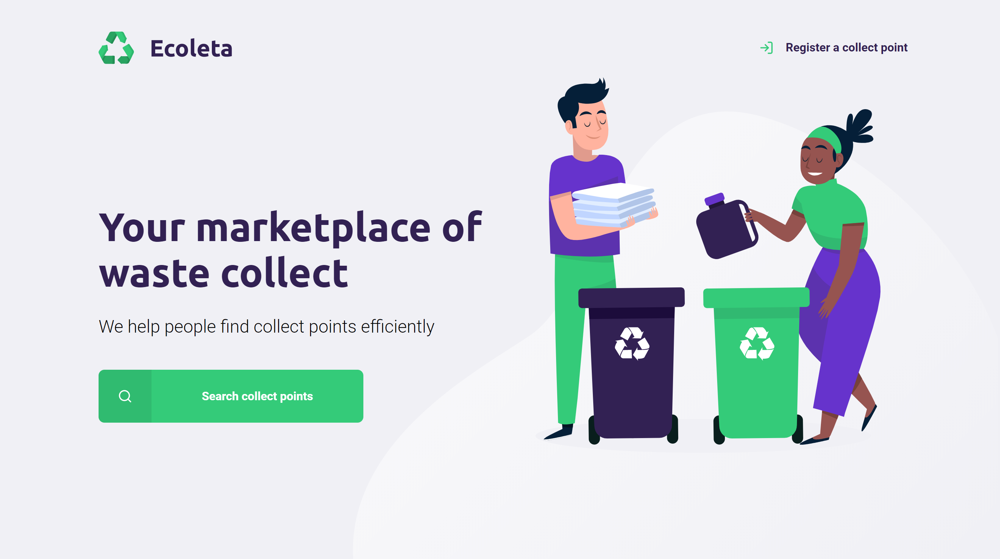
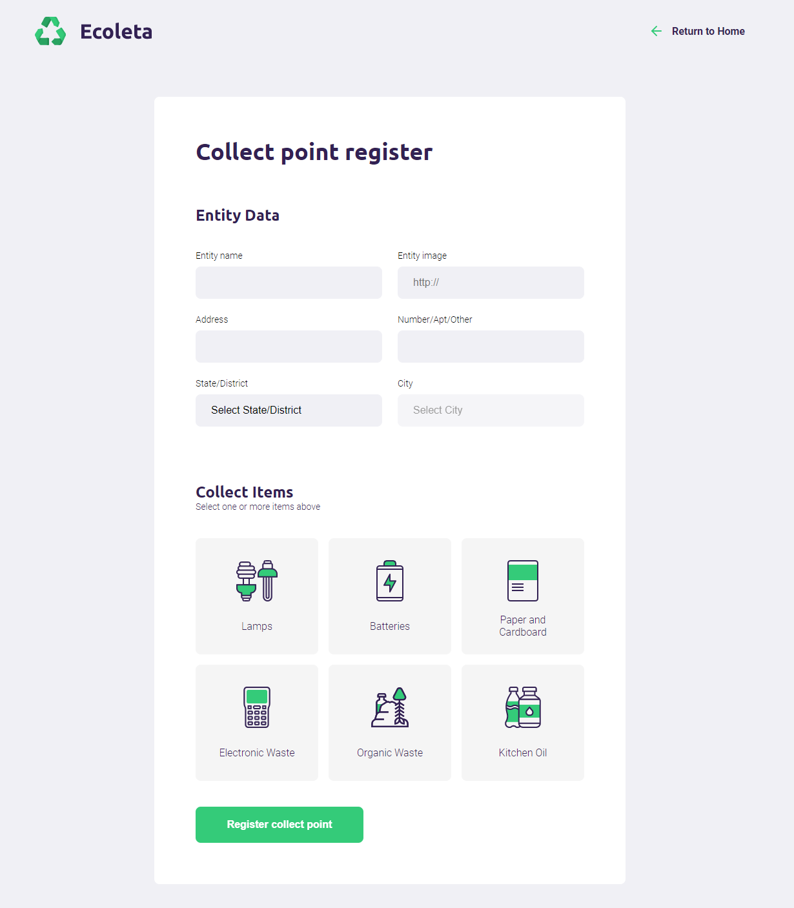
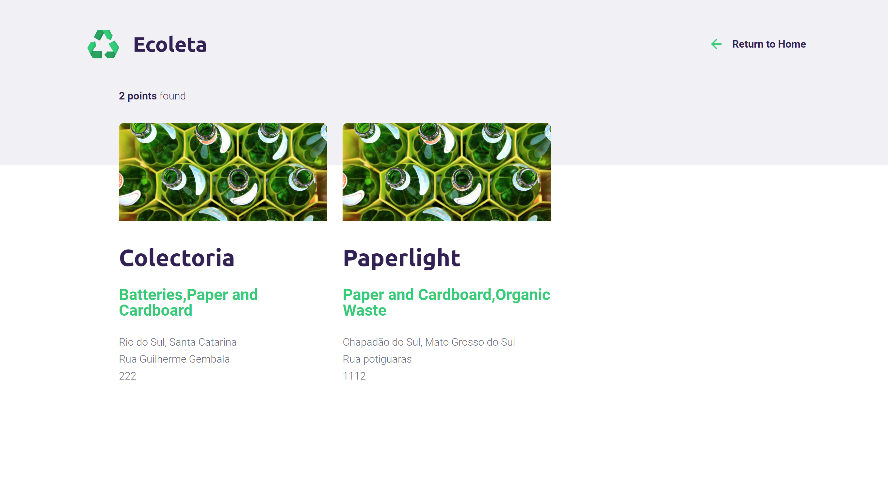
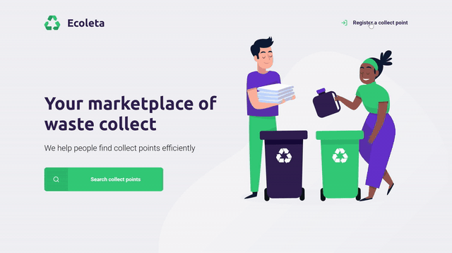

<h3 align="center">
    
    <br><br>
    <b>Recycle and help save our planet!</b>  
    <br>
</h3>

<br />

<h1 align="center">Index</h1>

<p align="center">
  <a href="#nlw">Next Level Week</a>&nbsp;&nbsp;&nbsp;|&nbsp;&nbsp;&nbsp;
  <a href="#about">About the Project</a>&nbsp;&nbsp;&nbsp;|&nbsp;&nbsp;&nbsp;
  <a href="#techs">Technologies</a>&nbsp;&nbsp;&nbsp;|&nbsp;&nbsp;&nbsp;
  <a href="#layout">Layout</a>&nbsp;&nbsp;&nbsp;|&nbsp;&nbsp;&nbsp;
  <a href="#how-to-use">How to Use</a>&nbsp;&nbsp;&nbsp;|&nbsp;&nbsp;&nbsp;
  <a href="#how-to-contribute">How to Contribute</a>&nbsp;&nbsp;&nbsp;|&nbsp;&nbsp;&nbsp;
  <a href="#license">License</a>
</p>

<p align="center">

  <a href="https://rocketseat.com.br">
    
  </a>
   <a aria-label="Completed" href="https://nextlevelweek.com/aulas/booster/1/edicao/1">
    </img>
  </a>

  
  
  <a href="https://github.com/Fcruz10/LaunchBase/commits/master">
    
  </a>

  <a href="https://www.linkedin.com/in/francisco-cruz-074208140/" >
    
  </a>
  
  

</p>

<br />

<a id="nlw"></a>
## :information_source: What's Next Level Week?


NLW is a practical week with lots of code, challenges, networking and a single objective: to take you to the next level.
Through our method you will learn new tools, learn about new technologies and discover hacks that will boost your career.
An online and completely free event that will help you take the next step in your evolution as a dev.

<br />

<a id="about"></a>
## :computer: About the Project

Ecoleta is a a waste collect market, a project developed based on international environment week. 
That aims to connect people to companies that collect specific waste such as light bulbs, batteries, cooking oil, etc.

<br />

<h1 style="display: flex; justify-content: space-between; align-items: center">
    
    
</h1>

<h1 style="display: flex; justify-content: space-between; align-items: center">
    
    
</h1>

<h1>
    
</h1>

<a id="techs"></a>
# :rocket: Technologies

This project was developed with the following technologies:

| Front-end  |   Back-end  |  API |
| :--------: | :---------: | :--: |
| <a href="https://mozilla.github.io/nunjucks/"></a> | <a href="https://nodejs.org/"></a> | [IBGE](https://servicodados.ibge.gov.br/api/docs/localidades?versao=1) |
| <a href="http://www.w3.org/TR/html5/"></a> | <a href="https://expressjs.com/"></a> |
| <a href="https://www.w3schools.com/Css/"></a> | <a href="https://nodemon.io/"></a> |
| <a href="https://www.javascript.com/"></a> | <a href="https://www.sqlite.org/"></a>

<a id="layout"></a>
## :bookmark: Layout

To access the layout use [Figma](https://www.figma.com/file/1SxgOMojOB2zYT0Mdk28lB/).

<a id="how-to-use"></a>
## :open_file_folder: How to Use

```bash

    # Clone this repository
    $ git clone https://github.com/Fcruz10/Ecoleta

    # Go into the repository
    $ cd ecoleta

    # Install dependencies
    $ npm install
    
    # Run
    $ npm start

    # running on port 3000
```

<a id="how-to-contribute"></a>
## :bulb: How to contribute

-  Make a fork;
-  Create a branch with your feature: `git checkout -b my-feature`;
-  Commit changes: `git commit -m 'feat: My new feature'`;
-  Make a push to your branch: `git push origin my-feature`.

After merging your receipt request to done, you can delete a branch from yours.

<a id="license"></a>
## :memo: License

This project is under the MIT license. See the [LICENSE](https://github.com/Fcruz10/Ecoleta/blob/master/LICENSE) for details.

<br />

<p align="center"> Made by Francisco Cruz <a href="https://www.linkedin.com/in/francisco-cruz-074208140/"> Get in touch! </a> </p>
